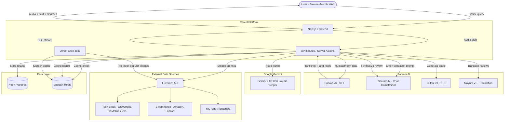

# SunkeLo — Product Specification

> Voice-first product review aggregator for Tier-2/3 India. Ask about any product in your language, get a synthesized review back as audio + text.

---

## 1. Executive Summary

India's next 500M internet users are voice-first. Before buying products — phones, books, kitchenware, fashion — they watch YouTube reviews, mostly in Hindi/English. Someone in Odisha or Assam is out of luck. SunkeLo solves this by letting users ask about any consumer product via voice in any supported Indian language, scraping/aggregating reviews from blogs, e-commerce, and YouTube, synthesizing a balanced opinion via Sarvam-M, generating a conversational audio summary via Gemini 2.0 Flash, and delivering the result as audio + text in the user's language.

### Implementation Status (Current)

- ✅ Sprint 1 completed: project foundation, tooling, DB/cache clients, schema, shared types, utility layer, landing shell
- ✅ Sprint 2 completed: voice capture + text fallback, STT integration layer, SSE query route and client hook, language badge display
- ✅ Sprint 3 completed: Sarvam chat/entity extraction, alias resolution, searching-status SSE, ProgressSteps UI, non-product rejection UI + tests
- ✅ Sprint 4 completed: Firecrawl client/scraper/parsers, Mayura translation wrapper + chunking, source normalization to English, `/api/sources` endpoint, optional Firecrawl contract smoke test
- ✅ Sprint 5 completed: review synthesis pipeline, structured ReviewCard UI, DB persistence, NO_REVIEWS flow, strict user-review evidence gate
- ✅ Sprint 6 completed: TTS wrapper (Bulbul v3), Vercel Blob storage, localization pipeline (translate + TTS), useAudioPlayer hook, AudioPlayer component, localized error messages
- ⚠️ Sprint 7 partial: SERVICE_UNAVAILABLE error path implemented. Review/alias/localized caches, retry with backoff, async query logging, quota UI still pending.
- ✅ Post-sprint enhancements: Gemini 2.0 Flash audio script generation, multi-language audio, broadened product search (all consumer categories), expanded source aggregation (13 blog + 4 ecommerce domains)
- ⏳ Sprint 7 completion + Sprint 8+ in planned state, tracked in `docs/sprints.md`

### Core Objectives

- Deliver synthesized, multi-source product reviews via voice in 11 Indian languages
- Sub-30s end-to-end latency from voice query to audio response
- Zero-auth, zero-friction UX -- land, tap mic, ask, get answer
- Cache-first architecture to maximize Firecrawl free tier and minimize latency

### Target Persona

**Ravi, 24, Bhubaneswar** -- Wants to buy a phone under 20K. Watches YouTube reviews but they're all in Hindi/English. His Odia is his comfort language. He opens SunkeLo on his phone browser, taps the mic, asks "Redmi Note 15 kemiti?" in Odia, and gets an audio + text review card in Odia within 15-20 seconds.

### Success Metrics

| Metric | Target |
|---|---|
| Query-to-first-content | < 8s (text starts streaming) |
| Query-to-audio-ready | < 30s |
| Cache hit rate | > 60% after week 1 |
| Daily active queries | 500+ within month 1 |
| Supported languages | 11 (10 Indic + English) |

---

## 2. Technical Architecture

### 2.1 Tech Stack

| Layer | Technology | Rationale |
|---|---|---|
| **Frontend** | Next.js 15 (App Router) | SSR for SEO on cached review pages, React Server Components, Vercel-native |
| **Runtime** | Node.js / TypeScript | Single-language monorepo, Sarvam JS SDK available |
| **Database** | Neon (Serverless Postgres) | Serverless-friendly, scales to zero, branching for dev |
| **Cache/Rate-limit** | Upstash Redis | Serverless Redis, HTTP-based, Vercel-native integration |
| **AI/ML** | Sarvam AI (STT, TTS, Translate, Chat) | Best-in-class Indic language support, free tier this month |
| **AI/ML** | Google Gemini (2.0 Flash) | Conversational audio script generation in user's language |
| **Scraping** | Firecrawl | Structured web scraping, free tier |
| **Deployment** | Vercel | Zero-config Next.js hosting, edge functions, analytics |
| **Analytics** | Vercel Analytics + PostHog (free) | Performance + product analytics |
| **Styling** | Tailwind CSS v4 | Utility-first, mobile-first responsive design |

### 2.2 System Context Diagram



### 2.3 Request Pipeline (Detailed)

```
1. CAPTURE    → Browser MediaRecorder captures WebM audio
2. UPLOAD     → POST /api/query with audio blob
3. STT        → Sarvam Saaras v3 (language_code="unknown") → transcript + detected lang
4. INTENT     → Sarvam-M: classify intent (product_review | unsupported)
5. EXTRACT    → Sarvam-M: extract product entity → { brand, model, variant }
6. NORMALIZE  → Normalize product name → cache key (e.g., "redmi-note-15-pro")
7. CACHE HIT  → Check Redis for cached review (TTL 7 days)
   └─ HIT  → Skip to step 11
   └─ MISS → Continue to step 8
8. SCRAPE     → Firecrawl: scrape blogs + e-commerce + YouTube transcripts
9. TRANSLATE  → Mayura v1: translate non-English reviews to English (normalization)
10. SYNTHESIZE → Sarvam-M: generate structured review from all sources
11. LOCALIZE  → Mayura v1: translate review summary to user's detected language
12. SCRIPT    → Gemini 2.0 Flash: generate conversational audio script in user's language
13. TTS       → Bulbul v3: generate audio from script (30-60s) in user's language
14. STREAM    → SSE: progressive updates → text card → audio URL
15. CACHE SET → Store synthesized review + audio in Redis + Postgres
```

---

## 3. Data Layer

### 3.1 Database Schema (Neon Postgres)

#### `products` table

| Column | Type | Constraints | Description |
|---|---|---|---|
| `id` | `uuid` | PK, DEFAULT gen_random_uuid() | Product ID |
| `slug` | `varchar(255)` | UNIQUE, NOT NULL | URL-friendly identifier, e.g., "redmi-note-15-pro" |
| `brand` | `varchar(100)` | NOT NULL, INDEX | Brand name normalized |
| `model` | `varchar(255)` | NOT NULL | Model name |
| `variant` | `varchar(100)` | NULLABLE | Variant (e.g., "128GB", "Pro+") |
| `category` | `varchar(50)` | NOT NULL, DEFAULT 'phone' | Product category |
| `price_range_min` | `integer` | NULLABLE | Minimum price INR |
| `price_range_max` | `integer` | NULLABLE | Maximum price INR |
| `image_url` | `text` | NULLABLE | Product thumbnail |
| `is_trending` | `boolean` | DEFAULT false | Featured on landing page |
| `created_at` | `timestamptz` | DEFAULT now() | Creation timestamp |
| `updated_at` | `timestamptz` | DEFAULT now() | Last update timestamp |

#### `reviews` table

| Column | Type | Constraints | Description |
|---|---|---|---|
| `id` | `uuid` | PK, DEFAULT gen_random_uuid() | Review ID |
| `product_id` | `uuid` | FK → products.id, NOT NULL, INDEX | Associated product |
| `verdict` | `varchar(20)` | NOT NULL | "buy", "skip", "wait" |
| `confidence_score` | `real` | NOT NULL | 0.0–1.0 based on source count/quality |
| `pros` | `jsonb` | NOT NULL | Array of pro strings (3-5) |
| `cons` | `jsonb` | NOT NULL | Array of con strings (3-5) |
| `best_for` | `varchar(255)` | NOT NULL | One-liner, e.g., "Budget gamers" |
| `summary_en` | `text` | NOT NULL | English base summary |
| `tldr_en` | `text` | NOT NULL | Short version for TTS (~100 words) |
| `source_count` | `integer` | NOT NULL | Number of sources used |
| `sources` | `jsonb` | NOT NULL | Array of {url, title, type} |
| `expires_at` | `timestamptz` | NOT NULL, INDEX | Cache expiry (created_at + 7 days) |
| `created_at` | `timestamptz` | DEFAULT now() | Creation timestamp |

#### `review_translations` table

| Column | Type | Constraints | Description |
|---|---|---|---|
| `id` | `uuid` | PK, DEFAULT gen_random_uuid() | Translation ID |
| `review_id` | `uuid` | FK → reviews.id, NOT NULL | Parent review |
| `language_code` | `varchar(10)` | NOT NULL | BCP-47 code, e.g., "od-IN" |
| `summary` | `text` | NOT NULL | Translated summary |
| `tldr` | `text` | NOT NULL | Translated TL;DR for TTS |
| `audio_url` | `text` | NULLABLE | Stored TTS audio URL (Vercel Blob or R2) |
| `created_at` | `timestamptz` | DEFAULT now() | Creation timestamp |
| **UNIQUE** | | `(review_id, language_code)` | One translation per language |

#### `query_logs` table

| Column | Type | Constraints | Description |
|---|---|---|---|
| `id` | `uuid` | PK, DEFAULT gen_random_uuid() | Log ID |
| `client_ip_hash` | `varchar(64)` | NOT NULL, INDEX | SHA-256 hashed IP (privacy) |
| `transcript` | `text` | NOT NULL | STT output |
| `detected_language` | `varchar(10)` | NOT NULL | Detected BCP-47 code |
| `extracted_product` | `varchar(255)` | NULLABLE | Extracted product name |
| `product_id` | `uuid` | FK → products.id, NULLABLE | Matched product (if any) |
| `intent` | `varchar(30)` | NOT NULL | "product_review" or "unsupported" |
| `cache_hit` | `boolean` | NOT NULL | Whether cache was hit |
| `latency_ms` | `integer` | NOT NULL | Total pipeline latency |
| `created_at` | `timestamptz` | DEFAULT now(), INDEX | Query timestamp |

### 3.2 Redis Cache Schema (Upstash)

| Key Pattern | Value | TTL | Purpose |
|---|---|---|---|
| `review:{product_slug}` | JSON: serialized review object | 7 days | Cached synthesized review |
| `review:{product_slug}:{lang_code}` | JSON: translated review + audio URL | 7 days | Cached localized review |
| `ratelimit:{ip_hash}` | Integer counter | 24 hours (reset midnight IST) | Rate limit counter |
| `trending:products` | JSON: array of product slugs | 1 hour | Landing page trending list |
| `product:alias:{alias}` | String: canonical product slug | 30 days | Alias mapping ("note 15" → "redmi-note-15") |

### 3.3 Data Access Patterns

| Operation | Frequency | Path |
|---|---|---|
| Check rate limit | Every request | Redis GET `ratelimit:{ip_hash}` |
| Lookup cached review | Every query | Redis GET `review:{slug}` |
| Lookup cached translation | Every query (after cache hit) | Redis GET `review:{slug}:{lang}` |
| Write new review | On cache miss | Postgres INSERT + Redis SET |
| Log query | Every request | Postgres INSERT (async, non-blocking) |
| Fetch trending products | Landing page load | Redis GET `trending:products` |
| Pre-index products | Cron (daily) | Firecrawl → Postgres + Redis |

### 3.4 Entity Relationship Diagram

```
products 1───N reviews
reviews  1───N review_translations
products 1───N query_logs
```

---

## 4. Application Structure

```
desitone/
├── .env.local                     # Local env vars (SARVAM_API_KEY, etc.)
├── .env.example                   # Template for env vars
├── next.config.ts                 # Next.js configuration
├── tailwind.config.ts             # Tailwind configuration
├── tsconfig.json
├── package.json
├── vercel.json                    # Cron job config
│
├── public/
│   ├── fonts/                     # Custom fonts (Noto Sans for Indic)
│   └── icons/                     # App icons, mic SVG
│
├── src/
│   ├── app/
│   │   ├── layout.tsx             # Root layout: fonts, metadata, analytics
│   │   ├── page.tsx               # Landing page: mic button, trending, chips
│   │   ├── globals.css            # Tailwind base + custom styles
│   │   │
│   │   ├── review/
│   │   │   └── [slug]/
│   │   │       └── page.tsx       # SEO-friendly cached review page
│   │   │
│   │   └── api/
│   │       ├── query/
│   │       │   └── route.ts       # POST: main voice query pipeline (SSE)
│   │       ├── sources/
│   │       │   └── route.ts       # POST: scrape + normalize review sources
│   │       ├── trending/
│   │       │   └── route.ts       # GET: trending products list
│   │       └── cron/
│   │           └── pre-index/
│   │               └── route.ts   # Vercel Cron: pre-index popular phones
│   │
│   ├── components/
│   │   ├── voice-input.tsx        # Mic button + MediaRecorder + waveform
│   │   ├── review-card.tsx        # Verdict, pros, cons, best-for, sources
│   │   ├── audio-player.tsx       # Custom audio player with play/pause
│   │   ├── query-chips.tsx        # Example query suggestions
│   │   ├── trending-grid.tsx      # Trending product cards
│   │   ├── progress-steps.tsx     # SSE progress indicator
│   │   └── language-badge.tsx     # Detected language display
│   │
│   ├── lib/
│   │   ├── sarvam/
│   │   │   ├── client.ts          # SarvamAIClient singleton
│   │   │   ├── stt.ts             # Speech-to-text wrapper
│   │   │   ├── tts.ts             # Text-to-speech wrapper
│   │   │   ├── translate.ts       # Mayura translation wrapper
│   │   │   ├── chat.ts            # Sarvam-M chat completions wrapper
│   │   │   └── types.ts           # Sarvam API types
│   │   │
│   │   ├── firecrawl/
│   │   │   ├── client.ts          # Firecrawl client
│   │   │   ├── scraper.ts         # Scrape orchestrator (blogs, ecom, YT)
│   │   │   └── parsers.ts         # Extract review content from scraped data
│   │   │
│   │   ├── pipeline/
│   │   │   ├── intent.ts          # Intent classification (product_review | unsupported)
│   │   │   ├── entity.ts          # Product entity extraction + normalization
│   │   │   ├── normalize-sources.ts # Scraped source normalization to English
│   │   │   ├── synthesize.ts      # Review synthesis prompt + structured output
│   │   │   ├── localize.ts        # Translation + TTS generation
│   │   │   └── orchestrator.ts    # Full pipeline coordinator (SSE emitter)
│   │   │
│   │   ├── db/
│   │   │   ├── client.ts          # Neon serverless driver
│   │   │   ├── schema.sql         # DDL for all tables
│   │   │   ├── products.ts        # Product CRUD queries
│   │   │   ├── reviews.ts         # Review CRUD queries
│   │   │   └── query-logs.ts      # Query log insert
│   │   │
│   │   ├── cache/
│   │   │   ├── client.ts          # Upstash Redis client
│   │   │   ├── reviews.ts         # Review cache get/set
│   │   │   └── rate-limit.ts      # IP-based rate limiter
│   │   │
│   │   └── utils/
│   │       ├── slug.ts            # Product name → slug normalization
│   │       ├── languages.ts       # Language code mappings + display names
│   │       └── constants.ts       # App-wide constants
│   │
│   ├── hooks/
│   │   ├── use-voice-recorder.ts  # MediaRecorder hook
│   │   ├── use-sse-query.ts       # SSE subscription hook
│   │   └── use-audio-player.ts    # Audio playback hook
│   │
│   └── types/
│       ├── review.ts              # Review, ReviewTranslation types
│       ├── product.ts             # Product types
│       ├── pipeline.ts            # SSE event types, pipeline state
│       └── api.ts                 # API request/response types
│
└── scripts/
    └── seed-products.ts           # Seed initial product catalog
```

### 4.1 Key Modules and Responsibilities

| Module | Responsibility |
|---|---|
| `pipeline/orchestrator.ts` | Coordinates the full STT→Extract→Cache→Scrape→Synthesize→Translate→TTS pipeline. Emits SSE events at each stage. |
| `pipeline/entity.ts` | Prompts Sarvam-M to extract structured product entity from transcript. Supports all consumer product categories. Normalizes to slug. Handles aliases. |
| `pipeline/synthesize.ts` | Constructs a review synthesis prompt with all scraped sources. Returns structured JSON (verdict, pros, cons, etc). |
| `pipeline/localize.ts` | Translates English base review to target language via Mayura. Generates conversational audio script via Gemini 2.0 Flash in the user's language. Falls back to template if Gemini unavailable. Generates TTS audio via Bulbul v3. |
| `gemini/gemini.ts` | Direct REST client for Gemini 2.0 Flash. Generates natural, conversational audio scripts (~150 words) in any supported language. |
| `firecrawl/scraper.ts` | Orchestrates parallel scraping across 13 blog domains, 4 e-commerce sites, and YouTube sources. Limits: 5 blogs, 4 e-commerce, 3 YouTube (up to 12 sources). |
| `cache/rate-limit.ts` | Implements sliding-window rate limiting: 5 queries/day per IP hash. Returns remaining quota. |
| `sarvam/client.ts` | Singleton SarvamAIClient instance with error handling, retries, and timeout config. |

---

## 5. Interface Definitions

### 5.1 API Endpoints

#### `POST /api/query` — Main Voice Query

The primary endpoint. Accepts audio, runs the full pipeline, streams results via SSE.

**Request:**

```
Content-Type: multipart/form-data

Fields:
  audio: File (WebM/WAV, max 10MB, max 30s duration)
```

**Response:** `Content-Type: text/event-stream`

```
event: status
data: {"step": "listening", "message": "Processing your voice..."}

event: status
data: {"step": "understood", "transcript": "Redmi Note 15 kaisa hai?", "language": "hi-IN"}

event: status
data: {"step": "searching", "product": "Redmi Note 15", "message": "Finding reviews..."}

event: status
data: {"step": "analyzing", "message": "Analyzing 8 sources..."}

event: review
data: {
  "product": {
    "slug": "redmi-note-15",
    "brand": "Redmi",
    "model": "Note 15",
    "priceRange": "₹15,999 - ₹18,999",
    "imageUrl": "..."
  },
  "verdict": "buy",
  "confidenceScore": 0.82,
  "pros": ["Excellent battery life (5500mAh)", "Great camera for the price", "AMOLED display"],
  "cons": ["Bloatware in MIUI", "Average speaker quality"],
  "bestFor": "Budget buyers who prioritize battery and camera",
  "summary": "...(localized full summary)...",
  "sources": [
    {"url": "https://...", "title": "GSMArena Review", "type": "blog"},
    {"url": "https://...", "title": "Flipkart Reviews", "type": "ecommerce"}
  ],
  "language": "hi-IN"
}

event: audio
data: {"audioUrl": "/api/audio/abc123.mp3", "durationSeconds": 35}

event: done
data: {"queryId": "uuid", "cached": false, "latencyMs": 18200}
```

**Error Events:**

```
event: error
data: {"code": "RATE_LIMITED", "message": "Daily limit reached. Come back tomorrow!", "remainingQuota": 0}

event: error
data: {"code": "NO_REVIEWS", "message": "Not enough reviews found for this product."}

event: error
data: {"code": "INSUFFICIENT_USER_REVIEW_EVIDENCE", "message": "Not enough user-review evidence."}

event: error
data: {"code": "NOT_A_PRODUCT", "message": "Ask about any product review or comparison."}

event: error
data: {"code": "STT_FAILED", "message": "Couldn't understand the audio. Please try again."}
```

#### `GET /api/trending` — Trending Products

**Response:** `200 OK`

```json
{
  "products": [
    {
      "slug": "redmi-note-15",
      "brand": "Redmi",
      "model": "Note 15",
      "priceRange": "₹15,999 - ₹18,999",
      "imageUrl": "...",
      "verdict": "buy",
      "reviewCount": 12
    }
  ]
}
```

#### `POST /api/sources` — Scrape + Normalize Sources (Sprint 4)

Takes a product slug/name and returns scraped, parsed, English-normalized review sources.

**Request:** `application/json`

```json
{
  "productSlug": "redmi-note-15"
}
```

**Response:** `200 OK`

```json
{
  "product": "Redmi Note 15",
  "productSlug": "redmi-note-15",
  "sourceCount": 3,
  "sources": [
    {
      "url": "https://example.com/review",
      "title": "Review",
      "type": "blog",
      "content": "Normalized english review text...",
      "originalLanguageCode": "hi-IN",
      "translatedToEnglish": true
    }
  ]
}
```

#### `GET /api/cron/pre-index` — Pre-Index Cron (Vercel Cron)

**Trigger:** Daily at 3:00 AM IST via `vercel.json` cron config.

**Auth:** `Authorization: Bearer CRON_SECRET`

**Behavior:** Scrapes/re-scrapes top 50-100 phones, refreshes Redis cache.

**Response:** `200 OK`

```json
{
  "indexed": 47,
  "skipped": 3,
  "errors": 0,
  "durationMs": 145000
}
```

### 5.2 External Integrations

#### Sarvam AI APIs

| API | Endpoint | Model | Auth Header | Purpose |
|---|---|---|---|---|
| Speech-to-Text | `POST https://api.sarvam.ai/speech-to-text` | `saaras:v3` | `api-subscription-key` | Voice → text + lang detect |
| Chat Completions | `POST https://api.sarvam.ai/v1/chat/completions` | `sarvam-m` | `Authorization: Bearer` | Entity extraction, intent classification, review synthesis |
| Translation | `POST https://api.sarvam.ai/translate` | `mayura:v1` | `api-subscription-key` | Cross-language review translation |
| Text-to-Speech | `POST https://api.sarvam.ai/text-to-speech` | `bulbul:v3` | `api-subscription-key` | Review TL;DR → audio |

**Sarvam STT Request Details:**

```
Content-Type: multipart/form-data
Fields:
  file: <audio binary>
  model: "saaras:v3"
  mode: "transcribe"
  language_code: "unknown"   ← enables auto-detection
```

**Sarvam STT Response:**

```json
{
  "request_id": "...",
  "transcript": "Redmi Note 15 कैसा है?",
  "language_code": "hi-IN",
  "language_probability": 0.95
}
```

**Sarvam-M (Chat Completions) — Entity Extraction Prompt Shape:**

```json
{
  "model": "sarvam-m",
  "messages": [
    {
      "role": "system",
      "content": "You are a product entity extractor. Given a user query about a phone, extract the brand, model name, and variant. Respond ONLY with JSON: {\"intent\": \"product_review\"|\"unsupported\", \"brand\": \"...\", \"model\": \"...\", \"variant\": \"...\"}"
    },
    {
      "role": "user",
      "content": "<transcript from STT>"
    }
  ],
  "temperature": 0.1
}
```

**Sarvam-M — Review Synthesis Prompt Shape:**

```json
{
  "model": "sarvam-m",
  "messages": [
    {
      "role": "system",
      "content": "You are a product review synthesizer. Given multiple review sources, produce a balanced, structured review. Respond ONLY with JSON: {\"verdict\": \"buy\"|\"skip\"|\"wait\", \"confidence_score\": 0.0-1.0, \"pros\": [...], \"cons\": [...], \"best_for\": \"...\", \"summary\": \"...(200-300 words)\", \"tldr\": \"...(50-80 words for voice)\"}"
    },
    {
      "role": "user",
      "content": "Product: <name>\n\nSource 1 (blog - GSMArena): <scraped content>\n\nSource 2 (ecommerce - Flipkart): <scraped content>\n\n..."
    }
  ],
  "temperature": 0.3
}
```

**Sarvam Translation Request:**

```json
{
  "input": "<english review text>",
  "source_language_code": "en-IN",
  "target_language_code": "od-IN",
  "model": "mayura:v1",
  "mode": "formal"
}
```

**Sarvam TTS Request:**

```
Content-Type: application/json
{
  "input": "<translated TL;DR text>",
  "target_language_code": "od-IN",
  "model": "bulbul:v3",
  "speaker": "<language-appropriate voice>"
}
Response: audio binary (WAV/MP3)
```

#### Firecrawl API

| Operation | Method | Purpose |
|---|---|---|
| `firecrawl_search` | Search | Find review URLs for a product |
| `firecrawl_scrape` | Scrape | Extract content from blog/ecom pages |

**Scrape Priority Order:**

1. **Blog reviews** — GSMArena, 91Mobiles, Smartprix, Android Authority, TechRadar, The Verge, CNET, Tom's Guide, NotebookCheck, Gadgets360, Digit, The Wirecutter, Goodreads (up to 5 sources)
2. **E-commerce reviews** — Amazon.in, Flipkart, Myntra, Ajio (up to 4 sources, user reviews + rating distributions)
3. **YouTube transcripts** — Top 3 review videos (extracted via transcript, cheapest)

**Firecrawl Search Query Template:**

```
"{product_name} review" site:gsmarena.com OR site:91mobiles.com OR ... OR site:goodreads.com
"{product_name} reviews ratings" site:amazon.in OR site:flipkart.com OR site:myntra.com OR site:ajio.com
```

**Firecrawl Free Tier Constraints:**

- Limited scrapes/month → aggressive caching + pre-indexing required
- On-demand scraping only for cache misses on non-pre-indexed products

#### Supported Languages (Sarvam Coverage)

| Language | BCP-47 Code | STT | TTS | Translate | Chat |
|---|---|---|---|---|---|
| English | `en-IN` | Yes | Yes | Yes | Yes |
| Hindi | `hi-IN` | Yes | Yes | Yes | Yes |
| Bengali | `bn-IN` | Yes | Yes | Yes | Yes |
| Tamil | `ta-IN` | Yes | Yes | Yes | Yes |
| Telugu | `te-IN` | Yes | Yes | Yes | Yes |
| Gujarati | `gu-IN` | Yes | Yes | Yes | Yes |
| Kannada | `kn-IN` | Yes | Yes | Yes | Yes |
| Malayalam | `ml-IN` | Yes | Yes | Yes | Yes |
| Marathi | `mr-IN` | Yes | Yes | Yes | Yes |
| Punjabi | `pa-IN` | Yes | Yes | Yes | Yes |
| Odia | `od-IN` | Yes | Yes | Yes | Yes |

---

## 6. Critical User Flows & Edge Cases

### 6.1 Happy Path: Voice Query → Review

```
1. User lands on SunkeLo (/) → sees mic button + trending phones + example chips
2. User taps mic button → browser requests microphone permission
3. User speaks: "Redmi Note 15 kaisa hai?"
4. Recording stops (auto after 5s silence OR manual tap)
5. Audio blob sent to POST /api/query
6. SSE stream begins:
   a. "Listening..." → STT processing
   b. "Got it: Redmi Note 15" → entity extracted, language detected (hi-IN)
   c. "Finding reviews..." → cache check (HIT → skip to f)
   d. "Scraping 6 sources..." → Firecrawl fetches blogs/ecom/YT
   e. "Analyzing reviews..." → Sarvam-M synthesizes
   f. Review card renders: verdict badge, pros/cons, best-for, sources
   g. Audio player appears with play button → user taps play → TL;DR audio in Hindi
7. User sees full text review + can tap source links
8. Review page is now available at /review/redmi-note-15 (SEO)
```

### 6.2 Happy Path: Cached Query

```
1. User asks about a popular phone already in cache
2. Pipeline skips steps 8-10 (scrape/translate/synthesize)
3. Only need: STT → entity extract → cache hit → localize to user's lang → TTS
4. Response in ~5-8 seconds instead of 20-30
```

### 6.3 Edge Case: Product Not Found / No Reviews

```
Trigger: Sarvam-M entity extraction returns a product, but Firecrawl finds 0-1 results
Response:
  event: error
  data: {"code": "NO_REVIEWS", "message": "This product doesn't have enough reviews yet. Try a popular phone like Redmi Note 15 or Samsung Galaxy S24."}
UI: Shows error message + trending products as fallback
```

### 6.3.1 Important limitation (current version)

```
Current pipeline still uses web-scraped signals, not a dedicated verified-purchaser dataset.
Authenticity is inferred from source domain + textual review cues.
So output should be interpreted as "real public user-review content where available",
not guaranteed pure user-only corpus.
```

### 6.3.2 Strict user-review evidence mode

```
When STRICT_REVIEW_EVIDENCE_MODE=true:
- Require at least STRICT_REVIEW_MIN_ECOMMERCE_SOURCES ecommerce sources (default 2)
- Require at least STRICT_REVIEW_MIN_SIGNAL_HITS review-signal hits (default 2)
- If thresholds fail, block synthesis and emit:
  event: error
  data: {"code":"INSUFFICIENT_USER_REVIEW_EVIDENCE","message":"Not enough user-review evidence."}
```

### 6.4 Edge Case: Non-Product Query

```
Trigger: User asks "weather kya hai?" or "tera naam kya hai?"
Detection: Sarvam-M intent classification returns "unsupported"
Response:
  event: error
  data: {"code": "NOT_A_PRODUCT", "message": "Main sirf phone reviews mein madad kar sakta hoon. Kisi phone ke baare mein poocho!"}
  (Localized to detected language)
UI: Shows friendly nudge + example query chips
```

### 6.5 Edge Case: Hinglish / Code-Mixed Speech

```
Trigger: User says "Redmi Note 15 ka camera accha hai kya bro?"
Handling: Saaras v3 handles code-mixed Hindi-English natively
STT output: transcript in detected dominant language (hi-IN)
Pipeline continues normally
```

### 6.6 Edge Case: Rate Limit Exceeded

```
Trigger: 6th query from same IP within 24 hours
Detection: Redis INCR on ratelimit:{ip_hash} > 5
Response:
  event: error
  data: {"code": "RATE_LIMITED", "message": "Aaj ke liye queries khatam ho gayi. Kal phir aana!", "remainingQuota": 0, "resetAt": "2026-02-17T00:00:00+05:30"}
UI: Shows quota exhausted message + reset time
```

### 6.7 Edge Case: Microphone Permission Denied

```
Trigger: User denies browser mic permission
Handling: Client-side detection, no API call made
UI: Show message "Mic access required" + instructions to enable in browser settings
Fallback: Show text input field as alternative (type product name manually)
```

### 6.8 Edge Case: STT Fails / Unintelligible Audio

```
Trigger: Background noise, too short, silence
Detection: Sarvam STT returns empty transcript or low confidence
Response:
  event: error
  data: {"code": "STT_FAILED", "message": "Samajh nahi aaya. Thoda aur clear bolein!"}
UI: Show retry button + tips ("Speak closer to mic", "Reduce background noise")
```

### 6.9 Edge Case: Sarvam API Downtime

```
Trigger: Any Sarvam API returns 500/503
Handling: Retry once with exponential backoff (2s)
If still failing:
  event: error
  data: {"code": "SERVICE_UNAVAILABLE", "message": "Servers busy hain. Thodi der mein try karo."}
Logging: Log to PostHog for monitoring
```

---

## 7. Quality Assurance

### 7.1 Testing Strategy

| Level | Tool | Scope | Coverage Target |
|---|---|---|---|
| **Unit** | Vitest | Pure functions: slug normalization, prompt builders, parsers, cache key generation, rate-limit logic | 90%+ |
| **Integration** | Vitest + MSW (Mock Service Worker) | API route handlers with mocked Sarvam/Firecrawl responses, DB queries against test Neon branch | 80%+ |
| **E2E** | Playwright | Full user flows: mic → SSE → review card → audio playback, rate limiting, error states | Happy path + all edge cases |
| **API Contract** | Zod schemas | Runtime validation of all Sarvam API responses, Firecrawl responses, internal API contracts | All external boundaries |

### 7.2 Key Test Scenarios

**Unit Tests:**
- Product slug normalization: "Redmi Note 15 Pro+" → "redmi-note-15-pro-plus"
- Language code mapping and display names
- Rate limit counter logic (increment, check, reset)
- Review synthesis prompt construction
- SSE event formatting

**Integration Tests:**
- Full pipeline with mocked external APIs
- Cache hit path (Redis returns data → skip scraping)
- Cache miss path (Redis empty → scrape → synthesize → cache)
- Rate limit enforcement (5th query passes, 6th rejected)
- Error propagation (Sarvam 500 → retry → user-facing error)
- Query logging (async insert doesn't block response)

**E2E Tests:**
- Record audio → submit → see progressive SSE updates → review card renders → audio plays
- Landing page: trending products load, example chips clickable
- SEO review page: `/review/redmi-note-15` renders with meta tags
- Mobile viewport: mic button accessible, review card readable
- Rate limit: 6 rapid queries → see limit message on 6th

### 7.3 Environment Variables

```env
# Sarvam AI
SARVAM_API_KEY=                    # Sarvam API subscription key

# Firecrawl
FIRECRAWL_API_KEY=                 # Firecrawl API key

# Database
DATABASE_URL=                      # Neon Postgres connection string

# Cache
UPSTASH_REDIS_REST_URL=            # Upstash Redis REST URL
UPSTASH_REDIS_REST_TOKEN=          # Upstash Redis REST token

# App Config
NEXT_PUBLIC_APP_URL=               # Public app URL
CRON_SECRET=                       # Secret for cron job auth
RATE_LIMIT_PER_DAY=5               # Queries per IP per day
DISABLE_RATE_LIMIT=false           # Local/dev toggle to bypass query limit when true
STRICT_REVIEW_EVIDENCE_MODE=false  # When true, blocks synthesis if user-review evidence is weak
STRICT_REVIEW_MIN_ECOMMERCE_SOURCES=2
STRICT_REVIEW_MIN_SIGNAL_HITS=2
REVIEW_CACHE_TTL_DAYS=7            # Review cache TTL in days

# Gemini
GEMINI_API_KEY=                    # Google Gemini API key (required for conversational audio scripts)

# Analytics
NEXT_PUBLIC_POSTHOG_KEY=           # PostHog project API key
NEXT_PUBLIC_POSTHOG_HOST=          # PostHog host URL
```
